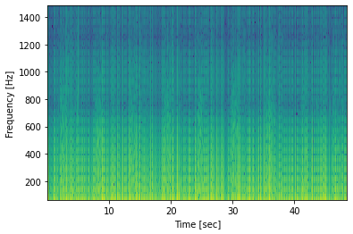
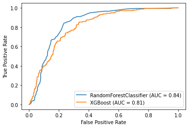

# breath-sound-detection

This was a short 'hackathon' style project for the [UKRI UCL Centre for Doctoral Training in AI-enabled Healthcare Systems](https://www.ucl.ac.uk/aihealth-cdt/) end of year symposium 2021.  

 

👩‍💻 Team: Chris Tomlinson, Joe Farrington, Vicky Smith  

🎯 Task: Free reign to envisage/prototype an AI-enabled solution to data captured from a digital stethoscope 🩺📈  

🌆 Commercial partner: Start-up operating in 'stealth mode' 🕵️‍♂️ 

⏰ Time scale: ~2 hours before delivering a 10 minute presentation 👨‍🏫   

 

## 💡 Our solution  
 

We constructed a Random Forest Classifier able to predict periods of inspiration (breathing in) from a `.wav` file from a digital stethoscope.  
 

1. We used [`librosa`](https://librosa.org/doc/latest/index.html) to import the `.wav` file, produce a spectrogram and store this as a numpy array  
2. We applied a High Pass Filter at 50 Hz and a Low Pass Filter at 1.5 kHz by cropping the numpy array to focus on the frequencies of interest, producing a feature matrix `X`   

 

3. An outcome vector `y` was created by manually listening to the `.wav` file and noting timestamps at which inspiration began and ended. These were then converted to a vector, of length `X`, where `y=1` during inspiration, else `y=0`  
4. We partitioned the `.wav` file into ~80/20% train/test split, manually adjusting the breakpoint to leave two complete breaths for test evaluation  
5. We trained a `RandomForestClassifier()` and `XGBClassifier()` using the `sklearn` package. We selected these algorithms for their well-documented high-performance
6. Evaluation on the held-out test set gave an `AUC = 0.84` for the Random Forest classifier, as seen on the ROC curve below  

 

* Despite achieving a remarkably good performance out-of-the-box it's important to note this model was trained and evaluated on the same `.wav` file (and patient), which does not a represent a real-world scenario
* Further work could involve:
    * Hyperparameter optimisation
    * Utilising additional data, from multiple patients, for both testing and training  
    * Use of a 'sliding-window' style approach and exploring deep learning solutions

 

Overall this was a really enjoyable morning. Having never taken part in a 'hackathon' or worked in the tech industry it was great a taste for the excitement and creativity that a sprint-style of working can bring, not to mention that after a year of COVID-19 enforced remote learning, collaborating with, and learning from, colleagues was a particular highlight!

Many thanks to the CDT team: Prof Paul Taylor, Dr Ken Li and Craig Smith, for their hard work in organising the event, as well as the commercial sponsors for their time, ideas and mentorship.  

I look forward to next year!